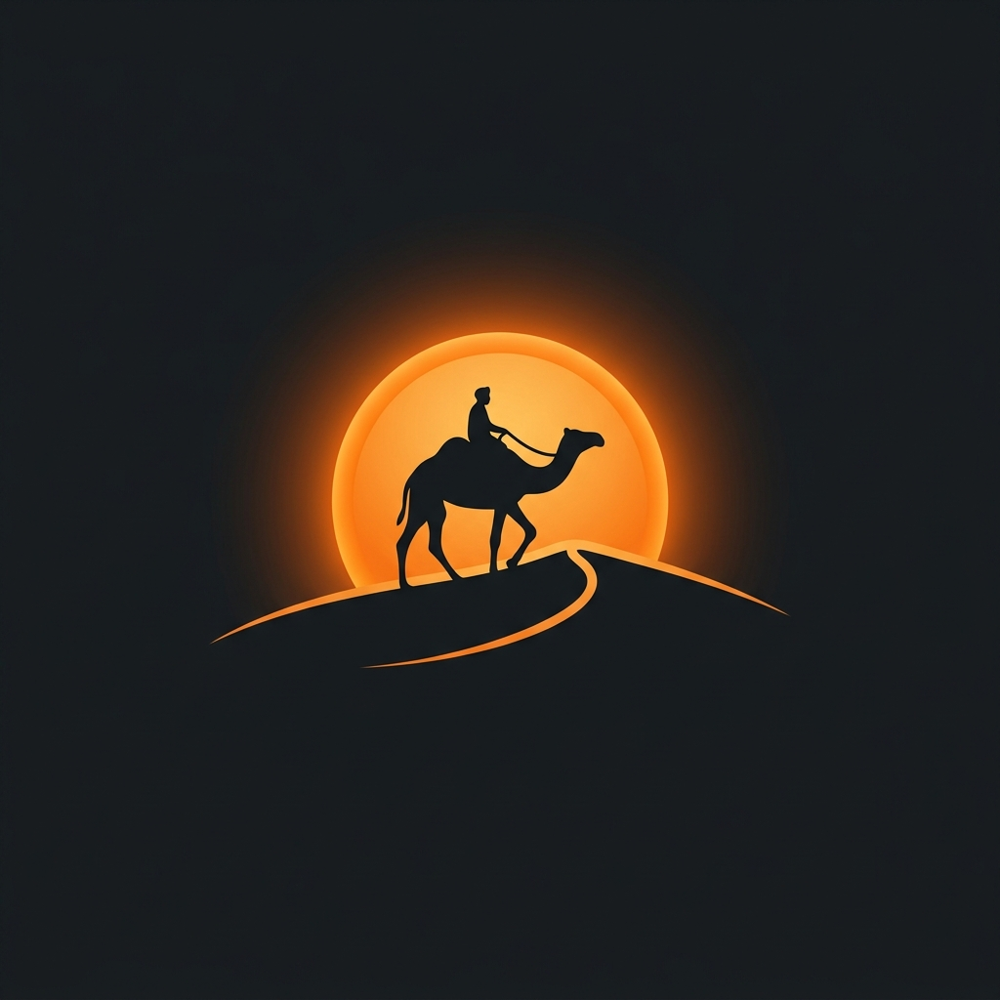

# Shivhari Tours and Desert Safari

Welcome to the official repository for **Shivhari Tours and Desert Safari**, a premium destination management agency located in the heart of Jaisalmer, Rajasthan.



## Overview

Shivhari Tours and Desert Safari provides unforgettable adventures in the Thar Desert. Our offerings include:
- **Luxury Desert Camp Stays**: Experience high-comfort tents, cultural folk dances, and local gourmet cuisine under the open sky.
- **Jeep Safaris**: Thrilling dune bashing experiences with certified drivers and 4x4 vehicles.
- **Camel Safaris**: Authentic desert rides with native guides.
- **Taxi & Sightseeing**: Reliable transportation and custom city tours.

## Tech Stack

This project is a modern, responsive web application built with:
- **React.js** (via Vite)
- **TypeScript**
- **Vanilla CSS** with a custom design system
- **React Router** for seamless navigation
- **Lucide React** for crisp, scalable iconography

## Features

- 🌓 **Light/Dark Mode**: Fully responsive theme toggling for accessibility.
- 📱 **Mobile-First Design**: Carefully crafted media queries for flawless mobile and tablet viewing.
- ✨ **Glassmorphism UI**: Beautiful frosted-glass aesthetic and subtle hover micro-animations.
- 🚀 **SEO Optimized**: Includes dynamically generated `sitemap.xml`, `robots.txt`, and metadata.
- 🏎️ **High Performance**: Optimized image loading and rapid Vite tooling.

## Getting Started

To run this project locally:

1. **Clone the repository:**
   ```bash
   git clone https://github.com/Eshbanoliver/Shivhari-Tours-and-Desert-Safari.git
   ```

2. **Navigate to the project directory:**
   ```bash
   cd jaisemertrip
   ```

3. **Install dependencies:**
   ```bash
   npm install
   ```

4. **Run the development server:**
   ```bash
   npm run dev
   ```

5. **Build for production:**
   ```bash
   npm run build
   ```

## Contact Information

**Booking Office:** Shop no 05, Airforce Road, Jaisalmer, Rajasthan - 345001  
**Email:** yashvyas7773@gmail.com  
**Phone:** +91 9079037934 / +91 9166306846  
**Domain:** [shivharitoursanddesertsafari.com](https://shivharitoursanddesertsafari.com)

---
*Crafted with passion for the Thar Desert.*
